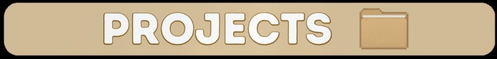
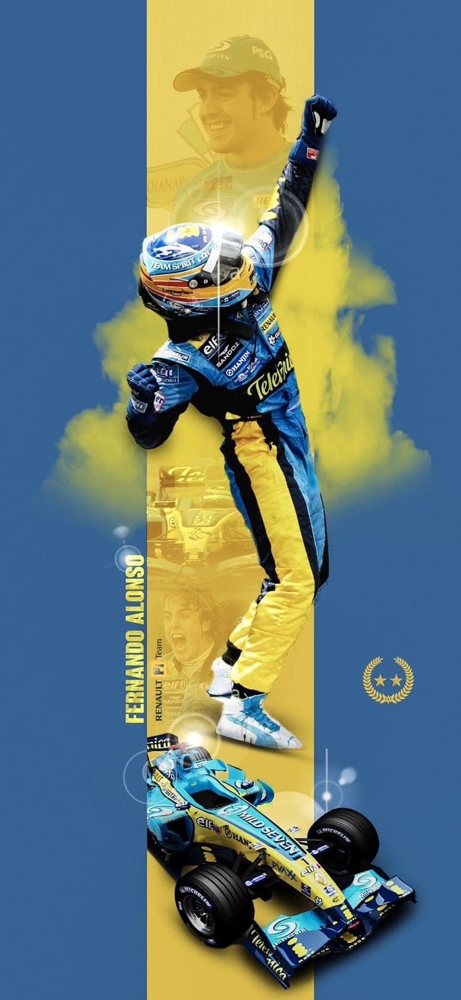
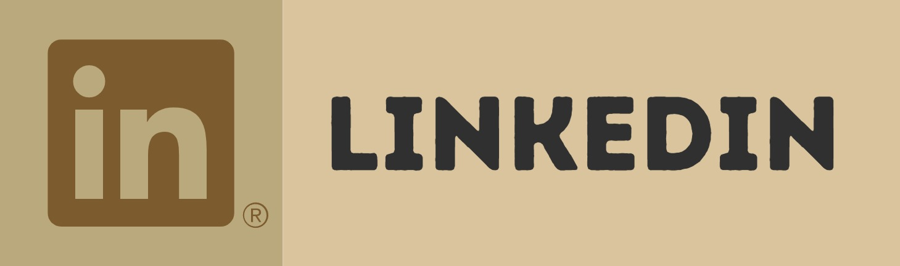
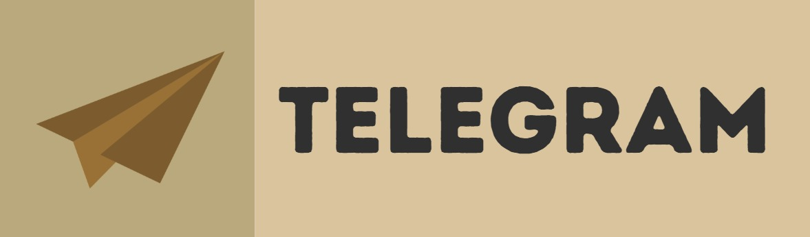

<!--

======================================================
 CREDITOS AO USER "xCr-9" (criador desse estilo de README), utilizei grande parte de seu codigo aqui.
======================================================

"
- Para fazer o Banner animado, pode pegar como base esse meu repositório aqui: https://github.com/Luk4x/github-profile-background-photo;

- O Contador de visitas que uso é esse: https://github.com/feri-irawan/visitor-badge;
- Você pode adicionar seu Spotify no seu readme seguindo esses passos: https://github.com/tthn0/Spotify-Readme;
- Para adicionar o gerador de frases, siga esses passos: https://github.com/PiyushSuthar/github-readme-quotes;
- Para criar um scoll em markdown, é simples. Se consiste numa tabela com uma definição de height que seja menor que sua proporção;
- A maioria dos ícones de tecnologias que utilizei, foi dessa projeto: https://github.com/tandpfun/skill-icons;
- Em relação aos cards com informações sobre o meu perfil, você pode encontrá-los em:
  - https://github.com/anuraghazra/github-readme-stats;
  - https://github.com/Ashutosh00710/github-readme-activity-graph;
  - https://github.com/DenverCoder1/github-readme-streak-stats;
- Para criar a animação de ondas que utilizei no final do readme: https://svgwave.in;
"
-->
<section>

  

 

 
<ul>
  <li>Ola, me chamo Derik, atualmete estou no 2 ano do ensino medio tecnico buscando minnha profissionalizacao como DBA.</li>
  <li> Gosto muito de jogos de corrida, metereologia e bater uma papo, se sinta livre para me chamar nas formas de contato abaixo ;) </li>

  <li>Estudando atualmente:Java e Spring Boot</li>
</ul>
   

</section>

<section>

<table height="250px">
  <tr>
    <td align="center">
      <a href="">
         
        <b><pre>Java</pre></b>
      </a>
    </td>
    <td align="center">
      <a href="">
         
        <b><pre>Spring Boot</pre></b>
      </a>
    </td>
    <td align="center">
      <a href="">
         
        <b><pre>Postgres (SQL)</pre></b>
      </a>
    </td>
  </tr>
  <tr>
    <td align="center">
      <a href="">
         
        <b><pre>API rest</pre></b>
      </a>
    </td>
    <td align="center">
      <a href="">
         
        <b><pre>Postman</pre></b>
      </a>
    </td>
    <td align="center">
      <a href="https://pop.system76.com/">
         
        <b><pre>Linux</pre></b>
      </a>
    </td>
  </tr>
  <tr>
    <td align="center">
      <a href="">
         
        <b><pre>IntelliJ</pre></b>
      </a>
    </td>
    <td></td>
    <td></td>
  </tr>
</table>
 

</section>
 

<section>

<table height="200px">
  <tr>
    <td>
    
    </td>
  </tr>
</table>
 

</section>

<section>

  

  

  <a href="mailto:deriksbatinga@gmail.com" target="_blank">
    
    &nbsp;
  </a>
  <a href="https://www.linkedin.com/in/derikbatinga/" target="_blank">
    
    &nbsp;
  </a>
  <a href="https://t.me/derik_sz" target="_blank">
    
    &nbsp;
  </a>
  

  

</section>
<section>

  

</section>
